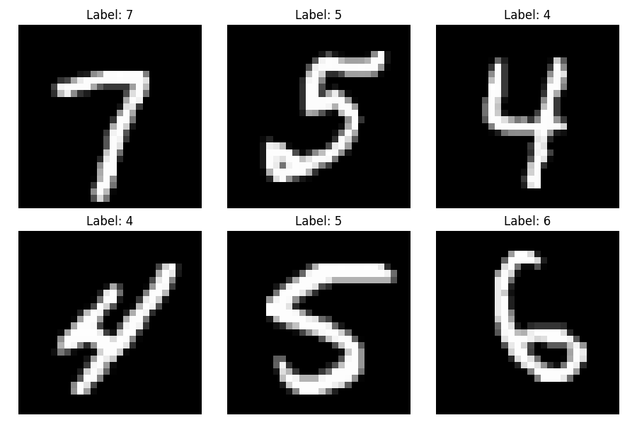
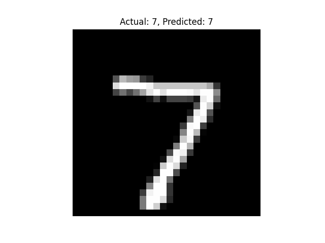
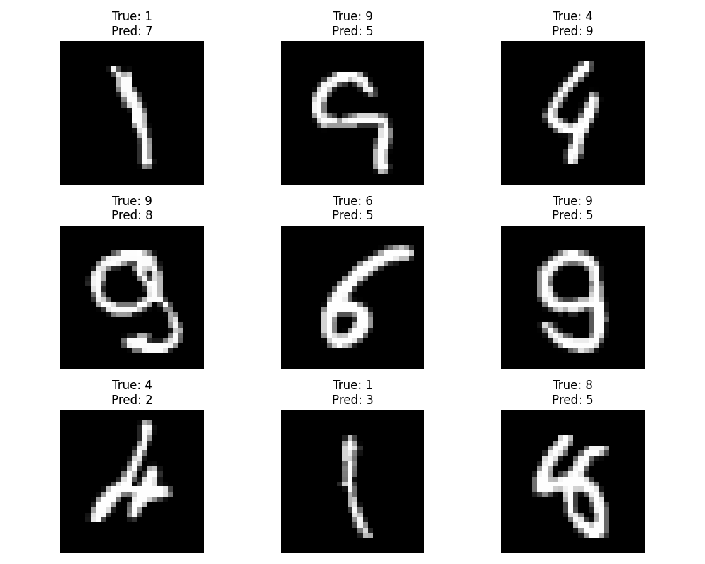

# MNIST Digit Recognition with PyTorch

## Overview
Recognizes handwritten digits (0-9) using a neural network trained on the MNIST dataset.

## Requirements
- Python 3.6+
- Packages: `pip install -r requirements.txt`

## Usage
1. Run the training script
2. Model will be saved as `mnist_model.pth`

## Results
- Test Accuracy: ~97% after 5 epochs
- Training Time: ~2 minutes on CPU
## Results
- Achieved Accuracy: 97.70%

## Results
- Achieved Accuracy: 97.41%

## Results
- Achieved Accuracy: 97.68%

## Results
- Achieved Accuracy: 96.87%

## Results
- Achieved Accuracy: 97.46%

## Results
- Achieved Accuracy: 96.86%

